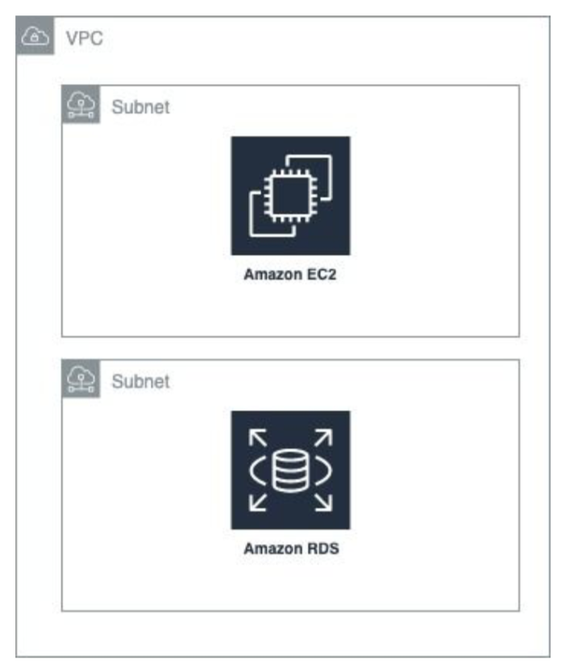
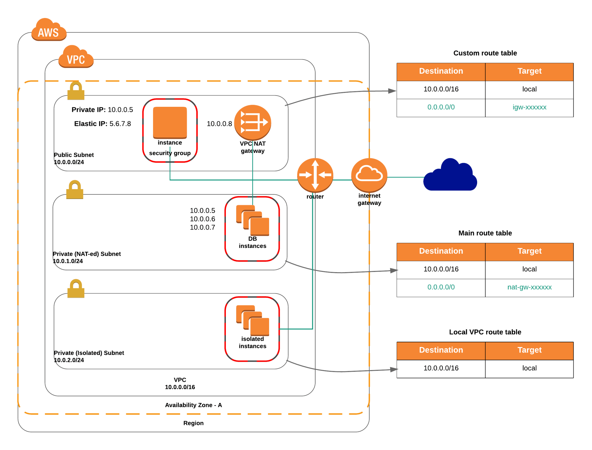

# Valinor Infrastructure
  
 This project tries to create resources to achieve the infrastructure in this diagram using Terraform: 
 

The structure of the project will be with modules separated by layer (network, storage, instances, etc).

To connect the EC2 instance to the internet we will have to add a few more resources. This is because provisioning an instance inside a private subnet and a vpc will leave an isolated instance and nothing to tell the system what ports are open and allowed and there is no path to route traffic to and from the internet as there is no public gateway to route it to. To allow internet access:

- `aws_subnet (public)`: Associates a public ip address inside the public subnet we use the subnet to do this automatically.
- `internet_gateway`: A way to open the subnet to the internet
- `default_route_table`: To point the traffic through the gateway
- `security_group`: To define the rules of outbound, inbound, protocols and ports through the subnet (we are also allowing ssh access).

This will make our subnet public and grant us access to and from the internet inside the EC2.

To create the database there need to be at least two different subnets in at least two availability zones. To create the database:

- `subnets`: In two different availability zones
- `subnet_group`: the list of the subnets to use for the db
- `aws_db_instance`: mysql community engine rds db

 ## Update

To further isolate the instances into layers, the project was modified to provide different levels of access according to the resource. The modification were:

- Modify the ec2 instance in the public subnet to work as a bastion
- Create a private subnet with a nat gateway and elastic ip.
- Create a route table to allow the subnet traffic through the nat gw.
- Create a new private ec2 instance with access outbound only access to the internet.
- Create a route table with only local traffic to isolate the database subnets.

This will enable to have instances in the public subnet, private backend instances in a private subnet and isolated instances that only allow local traffic inside the vpn (in this case the database).

The objective was to create something similar to this design:
 
 
 ## To deploy
 
 A deployment script is added to run formatting, validation, planning and application of the infrastructure. To use this script: 
 
 - Make sure you have added a public key in a new `.tfvars` file to support ssh access to the instances.
 
 - Make sure you have a matching profile in the same `.tfvars` file that matches a valid profile in your `.aws/credentials` file.
 
 Then run:
 
 ```shell script
 chmod +x deploy.sh
 ```

 And then try to deploy using:
 
 ```shell script
 ./deploy.sh -e <tfvars_env_file>
 ```
 You must supply the `.tfvars` file to use as environment configuration.
 
 ## Further on...
 
**Improvements**

The architecture can be improved to be more reliable in the following areas depending on the needs of the system:

- `Quality`: It would be nice to run this through a ci pipeline and to have integration tests for the project.
- `Fault tolerance and availability`: Add redundancy by having a second stack in another availability zone.
- `Scalability`: By having more than one stack across many availability zones we could handle bigger loads with a load balancer.

 ## Even further
 
**Modern architectures**

For this example it is assumed we are deploying traditional EC2 instances to run our applications. 
But to step things to more modern tools, the architecture could be further improved by exploring a design based on running container clusters such as ECS or EKS.

This has a huge impact as these tools are design to provide the highest availability and scalability by using modern design practices, optimizing resources and distributing loads.

This also has a huge impact in Quality as we would run containerized applications that could enable us easier integration testing, continous delivery, etc.
This will also impact maintainability, as running a container is easier to maintain for teams that work on the application and easier to move inside the infrastructure.
